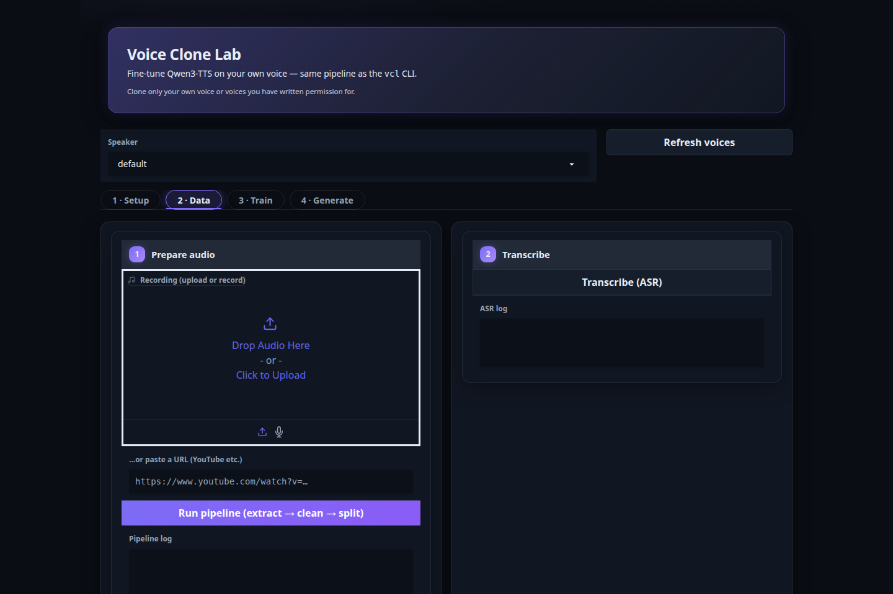

# Voice Clone Lab

Clone a voice from a few minutes of audio and generate speech from text — locally, on your
own GPU. Give it 5–15 minutes of clean speech (a recording, or a YouTube link) and it
fine-tunes [Qwen3-TTS](https://github.com/QwenLM/Qwen3-TTS) into a personal voice model you
can drive from a CLI or a web UI.



- **Any source**: upload a recording, record from your mic, or paste a YouTube/URL link
- **Guided pipeline**: extract → clean → split → transcribe → proofread in an editable table → train
- **Your voices, organized by name**: train as many as you like, pick one and type text
- **Zero-shot mode**: try a voice instantly from a single clip, no training
- **Fully local**: audio, transcripts, and voice models never leave your machine

## Consent notice

Use this project only for **your own voice** or a voice where you have **explicit written
permission** from the speaker. Do not use it for impersonation, fraud, bypassing consent,
harassment, or cloning public figures or private people without permission. The same rule
applies to URLs: only download content you have the rights to use.

## Requirements

- Linux with an NVIDIA CUDA GPU
- **Training**: 24 GB VRAM minimum (RTX 3090/4090 class, `batch-size 2`). 32 GB+ is comfortable.
- **Generation only** (using a checkpoint someone else trained): any ~8 GB card works.
- Python ≥ 3.10 (3.12 recommended), `ffmpeg`, `git`

## Install

```bash
git clone https://github.com/tetsuo-ai/voice_clone_lab.git
cd voice_clone_lab

pip install -e '.[ui]'     # core + web UI; drop [ui] for CLI-only
vcl setup --download       # fetch Qwen3-TTS (pinned + patched) and the 1.7B base weights (~4 GB)
vcl check                  # verify your machine is ready
```

Optional extras: `pip install -e '.[asr,yt,vad,denoise,dev]'` — WhisperX (word timestamps),
yt-dlp (URL sources), WebRTC VAD (better chunking), mild denoising, and the test suite.

## Quickstart

### 1. Get some audio of your voice

Record 5–15 minutes in a quiet room, one mic, natural reading pace
(ready-made reading text: `recording_scripts/voice_dataset_reading_script.txt`).
Or skip recording and paste a link to something you're in:

```bash
vcl run --speaker alex --input "https://www.youtube.com/watch?v=…"
# or a local file (wav/mp4/m4a/mp3):
vcl run --speaker alex --input ~/recordings/alex.wav
```

That one command extracts, cleans, splits, transcribes, and builds the dataset into
`data/voices/alex/`.

### 2. Proofread the transcripts (2 minutes, worth it)

```bash
vcl transcribe --speaker alex --review     # writes an editable TSV
# ...fix any wrong words in data/voices/alex/transcripts/transcripts_review.tsv...
vcl transcribe --speaker alex --apply-review --force
```

Bad transcripts are the #1 cause of weird pronunciation — don't skip this.

### 3. Train

```bash
vcl prepare --speaker alex          # add Qwen audio codes
vcl train --speaker alex            # fine-tune (add --batch-size 2 on a 24 GB card)
```

### 4. Talk

```bash
vcl generate --speaker alex --text "Hello, this is my cloned voice."
# -> outputs/generated/alex/test.wav
```

That's it. Train more voices the same way — everything lives under the speaker name.

## Web UI

```bash
vcl ui    # http://127.0.0.1:7860
```

Four tabs mirror the CLI: **Setup** (system check), **Data** (upload or paste a URL, run the
pipeline, edit transcripts right in the table), **Train** (hyperparameters, live log),
**Generate** (pick voice + checkpoint, sampling sliders, in-browser playback, zero-shot mode).

## How it organizes your data

Everything derives from the speaker name — no config editing per voice:

```
data/voices/<name>/        audio, chunks, transcripts, dataset, reference clip
outputs/checkpoints/<name>/checkpoint-epoch-*/    trained voice snapshots
outputs/generated/<name>/                         your generated wavs
```

Retraining a name replaces its old checkpoints (the CLI asks for `--force`; the UI asks you
to tick Overwrite). Epoch snapshots are independent — later is not always better, so compare
a couple and keep the one that sounds best.

## Useful commands

| Command | What it does |
|---|---|
| `vcl check` | Verify GPU, deps, models are ready |
| `vcl run --speaker X --input SRC` | Full data pipeline in one step (file or URL) |
| `vcl transcribe --review` / `--apply-review` | Proofread transcripts via TSV |
| `vcl prepare` / `vcl train` | Audio codes, then fine-tune |
| `vcl generate --speaker X --text "…"` | Speech from the newest checkpoint |
| `vcl generate --zeroshot --ref clip.wav --text "…"` | Instant clone, no training |
| `vcl generate --spec lines.json --outdir out/` | Batch: `[{"id","text"}, …]` → wavs |
| `vcl ui` | Web UI |

Every step refuses to overwrite existing outputs unless you pass `--force`. Full details:
`vcl <command> --help`.

## Troubleshooting

- **CUDA not found** → `nvidia-smi`, then `python -c "import torch; print(torch.cuda.is_available())"`.
  Install a CUDA-enabled PyTorch matching your driver.
- **Out of memory during training** → `--batch-size 2` (or 1). 24 GB VRAM is the floor.
- **Robotic / unstable voice** → cleaner source audio, fix transcripts, compare epoch
  checkpoints, go easy on denoise.
- **FlashAttention missing** → fine, everything falls back to `sdpa` automatically.

## Development

```bash
pip install -e '.[dev]'
python -m pytest tests/     # CPU-only test suite
```

Layout: `src/voice_clone_lab/` (pipeline modules + `cli.py` + `ui.py`), `config/default.yaml`
(single config source), `patches/` (vendor patch applied by `vcl setup`). See `AGENTS.md`
for conventions.

## Acknowledgements

Built on [Qwen3-TTS](https://github.com/QwenLM/Qwen3-TTS) (Apache-2.0) by Alibaba's Qwen team,
plus [faster-whisper](https://github.com/SYSTRAN/faster-whisper), [Gradio](https://gradio.app),
and [yt-dlp](https://github.com/yt-dlp/yt-dlp).

## License

Apache-2.0 — see [LICENSE](LICENSE).
